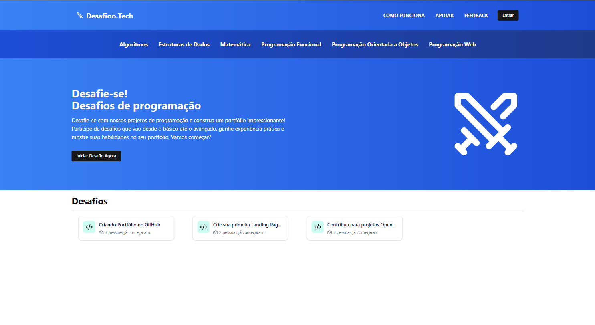

### Hey, Arthur Souza aqui! 👋

 Aqui, você pode conferir o que estou fazendo no momento e como pode contribuir com meus projetos open-source;

## Quer mandar sugestão de projetos e desafios para estudantes de programação? 
### Contribua com meus projetos open-source!

Estou sempre em busca de novos colaboradores para meus projetos. Se você tem interesse em contribuir, seja com código, documentação ou sugestões, sua ajuda será muito bem-vinda;

Confira os repositórios no GitHub e veja como você pode ajudar:

- [**Front-end**](https://github.com/ArthurSilv4/front-desafioo.tech) Ajude a criar interfaces intuitivas e dinâmicas para uma experiência de usuário atraente;

- [**Back-end**](https://github.com/ArthurSilv4/api-desafioo.tech) Contribua com a lógica e a estrutura que suportam desafios reais, criados por profissionais para preparar estudantes para o mercado;

Juntos podemos criar algo incrível!


## Projetos em Destaque
### Projetos em Atualização Contínua

Explore alguns dos projetos em que estou trabalhando ativamente;

- [**Plataforma Desafioo.tech**](https://www.desafioo.tech/) Uma plataform open-source com o objetivo de desafiar estudantes de programação a resolver problema reais ultilizando tecnologia e criatividade;




## Livros Recomendados

- [**HOOKED**](https://amzn.to/4emDevq) de Nir Eyal;

- [**A startup enxuta**](https://amzn.to/3Zi5evT) de Eric Ries;

- [**Duna**](https://amzn.to/3BEWIy5) de Frank Herbert;


## Redes

[**LinkedIn**](https://www.linkedin.com/in/arthur-souza-dev/) Acompanhe mais da minha jornada profissional e interaja comigo na rede profissional;

[**GitHub**](https://github.com/ArthurSilv4) Explore meus projetos, contribuições e tudo o que estou aprendendo no mundo do código;


## Agradeço pela visita!

Se você gostou do meu trabalho ou tem sugestões, fique à vontade para entrar em contato. E, claro, se quiser apoiar meus projetos, é só clicar na estrelinha do [**repositório**](https://github.com/ArthurSilv4/arthurdesouza.com/tree/master) no GitHub;

```csharp
Console.WriteLine("Sim, essa página foi desenvolvida com muito carinho");
```


